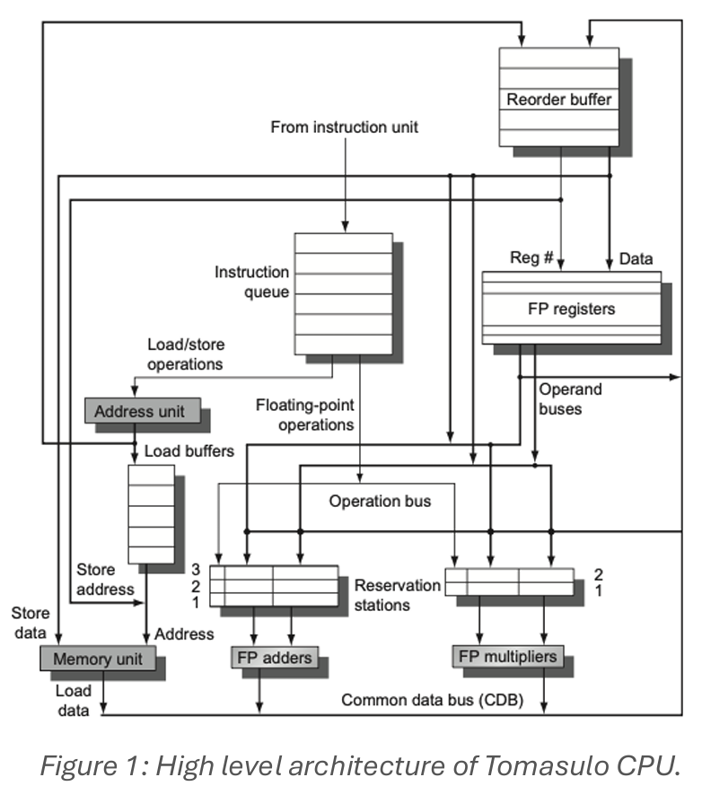

# RISC-V based Out-of-Order CPU leveraging Tomasulo's Algorithm.
This project implements an out-of-order RISC-V CPU using Tomasulo's algorithm for dynamic instruction scheduling. The design allows instructions to execute as soon as their operands are ready, rather than waiting in strict program order, improving performance through instruction-level parallelism.

## Features
1. Support for RV32I instruction set.
2. Out-of-order execution using Tomasulo's algorithm.
3. Multiple functional units operating in parallel (ALU, Multiplier, Divider, Memory).
4. Dynamic branch prediction with gshare predictor.
5. Register renaming through the reservation station tagging system.
6. Common Data Bus (CDB) for result broadcasting.

## Hardware Architecture
Tomasulo's OOO scheduling algorithm hardware structure:

The algorithm supports:
1. Dynamic instruction scheduling - instructions execute when ready, not in program order.
2. Register renaming via tagging - architectural registers mapped to ROB entries/reservation station tags to eliminate false dependencies.
3. Speculative execution - Uses gshare branch predicotr for predicting the branch targets.
4. Precise exceptions - maintains ability to handle interrupts correctly.

### Pipeline Stages
1. Instruction Fetch (IF) - Fetches instructions with branch prediction.
2. Issue (IS) - Decodes instructions and issues to reservation stations.
3. Execute (EX) - Out-of-order execution in functional units.
4. Commit (WB) - In-order commit via reorder buffer.

### Functional Units
1. ALU Unit: Single-cycle arithmetic and logic operations.
2. Multiplier Unit: Multi-cycle Booth multiplication algorithm.
3. Divider Unit: Multi-cycle non-restoring division algorithm.
4. Memory Unit: Load/store operations with single-cycle memory access.

### Other Hardware Structures
1. Reservation Stations: Buffer instructions waiting for operands (4 ALU, 2 MUL, 2 DIV, 4 MEM).
2. Reorder Buffer: Maintains program order for in-order commit.
3. Branch Prediction: gshare predictor with global history register.
4. Register Status: Tracks which instructions will write to each register.
5. Data Forwarding: Multiple forwarding paths to reduce pipeline stalls.